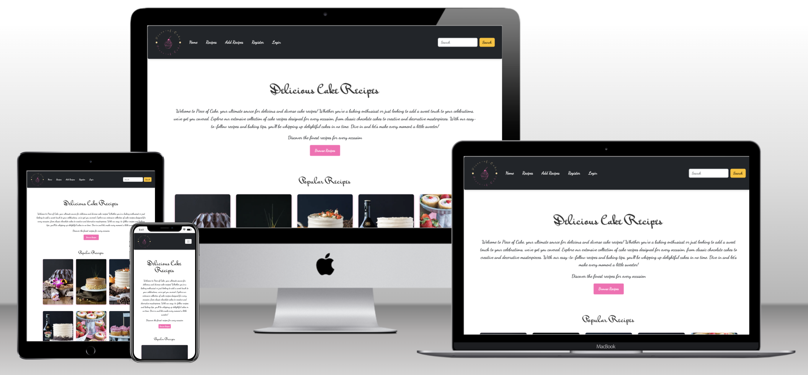

# Piece of Cake | Blog Recipe

# Introduction
Welcome to the Piece of Cake blog recipe repository! 🎂
Developed for Project Milestone 4 of the Code Institute Full-Stack Development Program, this blog is a full-stack Django project hosted on Heroku. 

It offers a delightful selection of cake recipes suitable for bakers of all skill levels. Users can comment, rate, and add their own recipes, while staff manage posts, categories, and comments from the frontend. 
Built with HTML, CSS, JavaScript, and Python using Django, the site ensures a responsive and visually appealing experience on any device. 

LIVE SITE

[You can view the live site here.](https://piece-of-cake-blog-5aad4b219313.herokuapp.com/)

GITHUB PAGES

[You can view the GitHub code pages here.](https://github.com/Cristina-Becheru/piece-of-cake)

---

## TABLE OF CONTENT
- [Introduction](#introduction)
  - [User Experience (UX)](#user-experience-ux)
      - [Client Goals](#client-goals)
      - [First Time Visitor Goals](#first-time-visitor-goals)
      - [Returning Visitor Goals](#returning-visitor-goals)
      - [Frequent Visitor Goals](#frequent-visitor-goals)
      - [Agile Methodology](#agile-methodology)
  - [Design](#design)
      - [Colours Used](#colours-used)
      - [Typography](#typography)
  - [Features](#features)
      - [Home Page](#home-page)
      - [Recipes](#recipes)
      - [Add Recipes](#add-recipes)
      - [Registration](#registration)
      - [Login](#login)
      - [Profile](#profile)
      - [Logout](#logout)
  - [Future Features](#future-features)
  - [Technologies Used](#technologies-used)
      - [Languages, Frameworks, Libraries \& Programs Used](#languages-frameworks-libraries--programs-used)
  - [Database](#database)
  - [Deployment](#deployment)
      - [Local Development](#local-development)
          - [Forking a Repository](#forking-a-repository)
          - [Cloning a Repository](#cloning-a-repository)
  - [Testing](#testing)  
  - [Credits](#credits)
      - [Resources](#resources)
  - [Acknowledgments](#acknowledgments)

## User Experience (UX)

  The "Piece of Cake" recipe blog offers an engaging and enjoyable experience for baking enthusiasts. With interactive features like comments, and the ability to submit your own creations, it invites users to actively participate and share their baking passion.

#### Client Goals
- *Engage Users*: Offer a rich and engaging experience where users can interact with and explore a variety of recipes.
- *Easy Navigation*: Provide clear and intuitive navigation to help users find recipes, manage comments, and access their profiles effortlessly.
- *User Interaction*: Allow users to see their own comments and recipes, edit or delete their own submissions, and upload a personal photo for a customized profile experience.
- *Comment Management*: Ensure comments are immediately visible without moderation; users can edit or delete their own comments, and admins have the authority to remove any comment if needed.
- *Responsive Design*: Deliver a smooth and accessible browsing experience across all devices, including mobile phones, tablets, and desktops, maintaining consistency and ease of use.
#### First Time Visitor Goals
- *Explore Recipes*: Discover a diverse range of cake recipes that are easy to follow and delicious to make.
- *Find a Recipe*: Search for specific recipes based on ingredients or name of cakes
- *Read Reviews*: View comments from other users to gain insights, tips, and feedback on various recipes.
- *Add Comments*: Contribute personal thoughts or feedback on recipes by leaving comments.
- *View Added Recipes*: Users can view and manage the recipes they have added to the blog after registration.
- *Learn More*: Get to know more about the blog and its offerings through links to social media platforms.

#### Returning Visitor Goals
- *Access Added Recipes*: Log in to view and manage recipes they have previously added.
- *Add New Recipes*: Submit new cake recipes or edit existing ones.
- *Edit or Delete Comments*: Modify or remove their own comments if needed.
- *Track Recipe Ratings*: View ratings and feedback on their recipes to see how others are responding.

#### Frequent Visitor Goals
- *Discover New Recipes*: Stay updated with the latest recipes added to the blog.
- *Submit New Recipes*: Contribute new recipes to the blog, enriching the recipe collection with fresh content.

#### Agile Methodology
Agile methodology was utilized to iteratively develop and improve the recipe blog, enabling flexibility and responsiveness to changes.GitHub and its Project Board features were used for managing tasks and tracking progress.
By applying Agile methodology, the development of the recipe blog becomes a structured yet flexible process, allowing for continuous improvement, responsiveness to user needs, and effective management of tasks and features.

## Design

### Colours Used
#### Header Colors

- *Navbar Background*: -- The dark background of the navbar provides a high-contrast backdrop that makes the navigation links stand out.
- *Navbar Links*: 
            -- The default color for navigation links contrasts well against the dark navbar background.
            -- When hovered over, the background color of the links changes to orange, while the text remains white for readability.

- *Navbar Toggler Button*: -- The button used to toggle the navigation menu on mobile devices has a white background, ensuring visibility and ease of use.
- *Search Button*: -- The search button in the form has a warning yellow color to attract attention and encourage user interaction.
- *Search Input Field*:
             -- The search input field has a white background to maintain a clean and accessible appearance.
             -- The border color of the input field is light gray, providing a subtle distinction without overwhelming the design.

#### Footer Colors

- The footer uses the same color scheme as the header, featuring a dark background with white text and orange hover effects for consistency. Additionally, it includes distinct colors for social media links: blue for Twitter, pink for Instagram , and standard color for GitHub.

#### Other colors used
- *Text Color*: (Dark Gray/Almost Black)
This color is used for the main text throughout the website. It provides strong contrast against lighter backgrounds, ensuring readability and clarity.

- *Primary Button Color*: (Pink)
The primary button color is a vibrant pink. This color is used for key interactive elements such as call-to-action buttons, providing a visually appealing and engaging look.

- *Button Hover Color*: (Light Pink)
When users hover over buttons, the color changes to a softer light pink. This subtle color shift enhances user interaction feedback and adds a touch of elegance to the interface.

- *Border Color*: (Light Gray)
This light gray color is used for borders and lines to create subtle divisions and boundaries within the design. It helps to visually organize content without being overpowering.

### Typography

- *'Mr Bedfort', cursive* - This font is used for titles and headings to give them a distinctive, elegant cursive style.
- *'Dancing Script', cursive* - This font is applied to the main body text to provide a smooth and stylish cursive appearance, enhancing readability and aesthetic appeal.

## Features

#### Home Page
The **Navbar** is consistently displayed across all pages of the website. It includes the following elements:

*Logo*: Positioned on the left side of the Navbar for brand recognition.

*Main Navigation*: Contains links to primary sections of the site, such as Home, Recipes, Add Recipe, and user-specific pages (Profile, Logout, Register, Login).

*Search Bar*: Located on the right side of the Navbar, allowing users to quickly search through the site’s content.

 **Main Content** of the home page is divided into two primary sections: the *Introduction Section*, which welcomes users and invites them to browse recipes, and the *Featured Cakes Section*, which visually showcases popular recipes. Both sections are designed to be visually appealing and user-friendly, encouraging engagement with the site's content.

**Footer** is designed to provide users with important links and information:

*Social Media Links*: Quick access to my profiles on Facebook, Twitter, Instagram, and GitHub.

*Copyright Notice*: Indicates content ownership and educational purpose.

#### Recipes
A dynamic, user-friendly page for browsing and filtering recipes. Key features include:

*Title*: Prominently displays "Latest Recipes."
*Filter Options*: Dropdowns to filter by cake type and flavor.
*Recipes Grid*: A grid of cards with images, titles, and brief descriptions. Click to view details.
*Pagination*: Navigate through pages while keeping filters applied.

#### Add recipes
The *Add Recipe* page enables authenticated users to submit new recipes to the application. For non-authenticated users, it displays a card with options to log in or sign up for an account.

#### Registration
The *Sign Up* page provides a registration form for new users to create an account for the application. 
The form includes fields for user information, and a prominent "Sign Up" button allows users to complete the registration process and gain access to the application’s features.Existing users can access a login link provided on the page.

#### Login
The *Login* page allows users to access their accounts with a secure login form.

#### Profile 
The *Profile* page shows user details and their own blog recipes. Users can view their profile information and see a list of their recipes with titles and posting dates. If no recipes are available, a message is displayed.

#### Logout
The *Logout* page asks users for confirmation and provides a centrally placed "Sign Out" button to complete the logout process.

## Future features
- Enable users to rate and review recipes, helping others make informed decisions.
- Allow users to save and manage their favorite recipes for easy access and reference.
- Provide video instructions for recipes to enhance user experience and engagement.
- Enable sharing of recipes on social media platforms.
- Allow users to edit and personalize their profiles, including updating personal information, profile pictures, and bios.
- Allow users to recover or reset their passwords through email verification, ensuring secure access to their accounts.

## Technologies used

### Languages, Frameworks, Libraries & Programs Used

- *HTML & CSS*: Used for the structure and styling of the website.

- *Django*: Used for backend development.

- *Crispy Forms*: Enhances the appearance and functionality of Django forms.

- *PostgreSQL*: Used for storing data.

- *Bootstrap*: Used for developing responsive and visually appealing web interfaces.

- *Cloudinary*: Manages my media storage.

- *Git*: Used for version control and collaboration.

- *Heroku*: Used for deploying and hosting the application.

- *Google Fonts* : Used fonts to enhance typography.

- *W3C Markup Validator*: Ensures HTML markup validity.

- *W3C CSS Validator*: Validates my CSS code for correctness.

- *Am I Responsive?*: Checks my website’s responsiveness across different devices.

- *Lighthouse*: Used for auditing and improving the performance, accessibility, and best practices of my blog.

- *ChatGPT*: Used for generating descriptions for recipes and comments.

- *Lucid*: Used for creating my data models.

- *VS Code*: Integrated development environment (IDE) used for coding.

## Database Model
The database model diagram for the recipe blog depicts the relationships between User, Profile, Recipe, and Comment. It illustrates how users manage profiles, create and interact with recipes, and leave comments.

## Deployment
### Getting Started
1. Configure Environment Variables

- Create a file named env.py in the root directory of your project.

- Add your database URL, secret key, and Cloudinary URL to env.py.

2. Update Django Settings

- Import the variables from env.py into your settings.py.

- Configure Django settings for your database, static files, and Cloudinary integration.

3. Dependencies

- Install required packages and update requirements.txt:

- Run pip install django gunicorn cloudinary

- Run pip freeze > requirements.txt

4. Static Files Setup

- Configure static file settings in settings.py.

5. Create a Procfile

- In the project root directory, create a Procfile with the content:web: gunicorn project_name.wsgi

6. Integrate Cloudinary

- Install Cloudinary and add it to INSTALLED_APPS in settings.py.

7. Update Allowed Hosts

- Modify ALLOWED_HOSTS in settings.py to include your Heroku app URL and other domains.

8. Database Migrations

- Run python manage.py makemigrations and python manage.py migrate.

9. Production Settings

- Set DEBUG to False in settings.py before pushing code to production.

### Heroku Deployment
1. Create a Heroku App

- Sign up or log in to Heroku.

2. Connect to GitHub

- Go to the 'Deploy' tab on Heroku.
- Choose 'GitHub' as the deployment method and link your repository.

3. Configure Environment Variables on Heroku

- Go to the 'Settings' tab on Heroku.
- Click 'Reveal Config Vars' and add:
-- *DATABASE_URL*
-- *SECRET_KEY*
-- *CLOUDINARY_URL*

4. Set Buildpacks

- Ensure the Heroku Python buildpack is added under 'Settings' > 'Buildpacks'.

5. Deploy Your App

- Select the branch you want to deploy (usually main) and click 'Deploy Branch'.

6. View Your Live App

- Access your application via the Heroku app URL.

### Local Development

#### Forking a repository
- Log in to GitHub.
- Navigate to the repository you wish to fork.
- Click the 'Fork' button.

#### Cloning a repository
- Log in to GitHub.
- Go to the repository you want to clone.
- Click the 'Code' button and copy the URL.
- Open your terminal, navigate to your desired directory, and run git clone <repository_url>.

## Testing
The site was thoroughly tested during development, with immediate fixes applied to resolve any issues.

Details of testing and bug resolutions are documented in the file below.

[TESTING.md file](TESTING.md)

## Credits

### Resources
- *Recipes and Images*: All recipes and images were sourced from [Liv for Cake](https://livforcake.com/)

- The initial setup code for this project was adapted from the [Code Institute "I Think Therefore I Blog"](https://codeinstitute.net/) course.

- *Tutorials*:
  - [Building a Blog Application with Django](https://djangocentral.com/building-a-blog-application-with-django/)

  - [Creating a Comments System with Django](https://djangocentral.com/creating-comments-system-with-django/)

  - [Python Django Tutorial for Beginners](https://www.youtube.com/watch?v=rHux0gMZ3Eg)

  - [Complete Responsive Food website using HTML, CSS, Bootstrap and JavaScript](https://www.youtube.com/watch?v=ccNvJfonP3k&t=156s)

  - *Stack Overflow*: Assisted in resolving various technical issues encountered during development.
  
## Acknowledgements
- *Code Institute*: Provided essential resources and guidance that were fundamental in developing the project.

- *Slack Community*: Offered invaluable support and feedback throughout the development process.