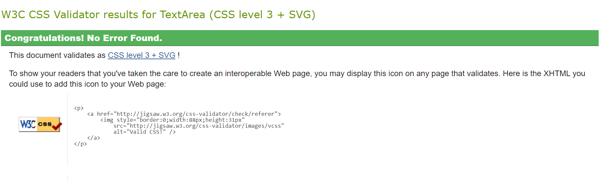
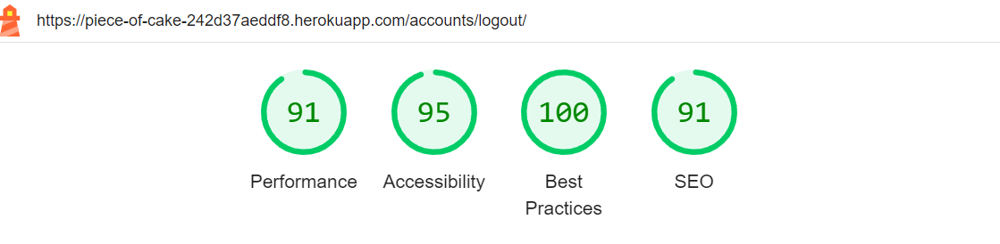

# Piece of Cake | Blog Recipe - TESTING

LIVE SITE

[You can view the live site here.](https://piece-of-cake-blog-5aad4b219313.herokuapp.com/)

# Testing
- [Django built-in test framework](#djangos-built-in-test-framework-results)
- [Code Validation](#code-validation)
    - [HTML](#html)
    - [CSS](#css)
    - [Python](#python)
- [Browser Compatibility](#browser-compatibility)
- [Lighthouse](#lighthouse)
- [Manual Testing](#manual-testing)

## Django’s built-in test framework Results

The test results from Django’s built-in framework confirm that all major functionalities of the blog, from user interactions to data handling, work as intended. Any issues identified during testing were addressed to ensure a smooth user experience.

## Code Validation

### CSS

## Browser Compatibility

Ensuring that the "Piece of Cake" recipe blog functions seamlessly across various browsers is crucial for delivering a consistent user experience. Below is a detailed account of how the website performs on different web browsers:

| **Browser**        | **Results**                                                                                | **Pass/Fail** | **Notes**                                                                                                                              |
|--------------------|--------------------------------------------------------------------------------------------|---------------|----------------------------------------------------------------------------------------------------------------------------------------|
| **Google Chrome**  | The website operates smoothly, with all pages and features performing as intended.         | PASS          | All pages and features operate successfully.                                                                                           |
| **Firefox**        | The site loads correctly across all pages, and interactive features are fully operational. | PASS          | All pages and features operate successfully.                                                                                           |
| **Microsoft Edge** | All pages and features function as expected, with no significant issues reported.          | PASS          | All pages and features operate successfully.  |

## Lighthouse

Lighthouse evaluations provided insights into the performance, accessibility, and SEO of the blog. The results highlighted strengths and pinpointed areas for improvement, ensuring the site meets high standards of quality.

## Manual Testing

| **Category**         | **Features**       | **Expected Outcome**                                                                                                      | **Testing Performed**                                                                         | **Pass/Fail** |
|----------------------|--------------------|---------------------------------------------------------------------------------------------------------------------------|-----------------------------------------------------------------------------------------------|---------------|
| **Navbar**           | Logo link          | Clicking on the logo should return users to the Home page from any other section of the website.                          | Tested by clicking the logo from various pages and confirming it navigates to the Home page.  | Pass✅         |
|                      | Recipes            | Selecting "Recipes" from the navbar should navigate to the Recipes page where users can view recipes.                     | Clicked on the "Recipes" link and confirmed it redirected to the page displaying recipes.     | Pass✅         |
|                      | Add Recipes        | The "Add Recipes" link should take users to a page where they can submit new recipes, accessible when logged in.          | Verified by clicking the "Add Recipes" link and ensuring it directed to the submission page.  | Pass✅         |
|                      | Profile            | Clicking on the "Profile" link should take users to their profile page where they can view their information and recipes. | Accessed the profile page and confirmed it displayed user information and recipes correctly.  | Pass✅         |
|                      | Responsiveness     | The website should adjust properly on different devices and screen sizes, ensuring usability on all platforms.            | Checked site appearance and functionality on various devices and screen sizes.                | Pass✅         |
| **Comments/Recipes** | Add a Comment      | Users should be able to add comments to recipes.                                                                          | Added a comment and confirmed it appears correctly.                                           | Pass✅         |
|                      | Edit a Comment     | Logged-in users should be able to modify their own comments regardless of their approval status.                          | Edited both approved and pending comments and verified changes were applied.                  | Pass✅         |
|                      | Delete a Comment   | Logged-in users should be able to delete their own comments.                                                              | Deleted comments and verified they were removed successfully.                                 | Pass✅         |
|                      | Edit Recipe        | Users should be able to edit their own recipes after logging in.                                                          | Edited an existing recipe and confirmed the updates were saved.                               | Pass✅         |
|                      | Delete Recipe      | Users should be able to remove their own recipes, with a confirmation prompt to ensure intentional deletion.              | Deleted a recipe and verified it was permanently removed from the list.                       | Pass✅         |
| **Pagination**       | Navigation Buttons | The pagination controls should navigate users through the pages of recipes accurately.                                    | Clicked "Next" and "Previous" buttons to ensure they correctly navigate between recipe pages. | Pass✅         |
| **Footer**           | Social Media Links | The social media icons in the footer should link to the appropriate social media profiles.                                | Clicked on social media icons and verified they lead to the correct profiles.                 | Pass✅         |